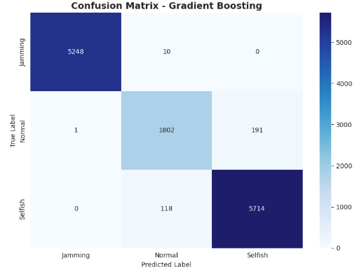
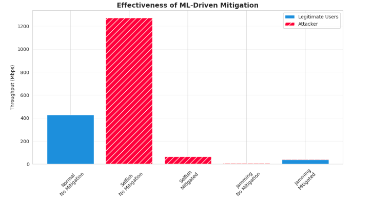

# Selective Detection and Mitigation Framework for WSN DoS Attacks


[](https://www.kaggle.com/)


## 📌 Overview

This repository implements a **Selective Detection and Mitigation Framework** designed to secure Wireless Sensor Networks (WSNs) against two distinct types of Denial of Service (DoS) attacks: **MAC-layer Selfish Misbehavior** and **PHY-layer Jamming**.

While both attacks result in similar symptoms, such as packet loss and throughput degradation, they require fundamentally different countermeasures. This project uses a **Machine Learning (Gradient Boosting)** approach to accurately classify the network state based on packet-level features and triggers targeted mitigation strategies:

- **Access Point based Policing** for Selfish nodes (Packet Dropping).
- **Robust Mode Switching** for Jamming scenarios (Low Data Rate).

> **Note:** The simulation, model training, and evaluation for this project were designed to run within a **Kaggle Notebook** environment.
---

## 🚀 Key Features

- **Discrete-Event Simulator**: Custom Python-based WSN simulator modeling IEEE 802.11 DCF, including backoff logic and channel contention.
- **Feature Engineering**: Extraction of behavioral metrics such as `Queuing_Delay`, `Transmission_Time`, `Propagation_Delay`, and `isContinuouslyOccupied`.
- **ML Detection Engine**: Trained **Gradient Boosting Classifier** distinguishing Normal, Selfish, and Jamming states with **97.5% accuracy**.
- **Automated Mitigation**:
  - **Anti-Selfish**: Access Point identifies and blacklists the cheating node with a **95% drop probability**.
  - **Anti-Jamming**: Network switches to robust, low-data-rate modulation (**11 Mbps**) to increase survival probability to **90%**.

---

## ⚙️ Simulation Parameters

The simulation is configured with the following network parameters matching standard 802.11g characteristics:

| Parameter | Value | Description |
| :--- | :--- | :--- |
| **Total Nodes** | 10 | 1 Attacker, 9 Legitimate Nodes |
| **Data Rate (Normal)** | 54 Mbps | Standard transmission rate |
| **Data Rate (Robust)** | 11 Mbps | Fallback rate for Anti-Jamming |
| **Payload (Normal)** | 1460 Bytes | Standard TCP/IP packet size |
| **Payload (Jamming)** | 8 Bytes | High-frequency noise packets |
| **Slot Time** | 9 µs | 802.11 standard slot time |
| **Contention Window** | 15 - 1023 | Random backoff range |

---

## 💻 How to Run on Kaggle

Since this project is a single-script simulation, the easiest way to run it is by importing the code into a Kaggle Notebook.

1.  **Get the Code**:
    * Copy the code from the `Mitigation_framework_for_dos_attack_in_WSN.ipynb` file in this repository.

2.  **Create a Kaggle Notebook**:
    * Go to [Kaggle](https://www.kaggle.com/).
    * Click **"Create"** -> **"New Notebook"**.

3.  **Setup Environment**:
    * Kaggle's default environment already includes all necessary libraries (`numpy`, `pandas`, `sklearn`, `seaborn`, `matplotlib`). No `pip install` is required.

4.  **Run Simulation**:
    * Paste the code into a code cell.
    * Run the cell.
    * The script will:
        1.  Generate the synthetic WSN dataset.
        2.  Train the Machine Learning models.
        3.  Run the online mitigation simulation.
        4.  Output the classification reports and throughput tables.

5.  **View Results**:
    * The script automatically saves two images (`confusion_matrix.png` and `fixed_mitigation_results.png`) to the Kaggle **Output** directory (usually found in the right-hand sidebar under "Data" > "Output").

---

## 📊 Results & Analysis

The framework was evaluated using approximately **43,000 samples** generated from the simulation.

### 1. Model Performance Comparison

| Model | Accuracy | Precision | Recall | F1-Score |
| :--- | :--- | :--- | :--- | :--- |
| **Gradient Boosting** | **0.9755** | **0.9754** | **0.9755** | **0.9754** |
| AdaBoost | 0.9752 | 0.9750 | 0.9752 | 0.9751 |
| Naive Bayes | 0.9752 | 0.9750 | 0.9752 | 0.9751 |
| KNN | 0.9747 | 0.9745 | 0.9747 | 0.9746 |
| Random Forest | 0.9525 | 0.9524 | 0.9525 | 0.9524 |
| Extra Trees | 0.9523 | 0.9523 | 0.9523 | 0.9523 |
| Decision Tree | 0.9523 | 0.9523 | 0.9523 | 0.9523 |

**Analysis**: Gradient Boosting achieves the highest consistency across all metrics, ensuring robust detection against false positives.

### 2. Detailed Classification Report (Gradient Boosting)

| Class | Precision | Recall | F1-Score | Support |
| :--- | :--- | :--- | :--- | :--- |
| **Jamming** | **1.00** | **1.00** | **1.00** | 5,258 |
| Normal | 0.93 | 0.90 | 0.92 | 1,994 |
| Selfish | 0.97 | 0.98 | 0.97 | 5,832 |
| **Accuracy** | | | **0.98** | **13,084** |

#### Confusion Matrix
The confusion matrix below visualizes the classification accuracy. The diagonal dominance confirms that misclassifications are minimal.



**Key Insight**: The model achieves perfect precision (1.00) for Jamming detection, ensuring no legitimate or selfish nodes are incorrectly misclassified as jammers.

### 3. Mitigation Effectiveness (Throughput Analysis)

| Scenario | Type | Legitimate (Mbps) | Attacker (Mbps) | Impact / Explanation |
| :--- | :--- | :--- | :--- | :--- |
| **Normal** | No Mitigation | **427.68** | 0.00 | Baseline performance. |
| **Selfish** | No Mitigation | 0.06 | **1272.80** | DoS (Starvation). |
| **Selfish** | **Mitigated** | 0.19* | **65.08** | **95% attacker reduction.** |
| **Jamming** | No Mitigation | 3.96 | 6.19 | DoS (Link Failure). |
| **Jamming** | **Mitigated** | **39.66** | 5.68 | **Connectivity restored.** |

#### Visualizing Throughput Recovery
The chart below illustrates the network state before and after mitigation. Note the drastic reduction in the red bar (Attacker) during the Selfish scenario and the recovery of the blue bar (Legitimate) during the Jamming scenario.



> ***Note**: Legitimate throughput remains low during Selfish mitigation due to the attacker still attempting to flood the channel, but the Attacker's throughput is slashed from 1272 Mbps to 65 Mbps, enforcing a "starvation strategy".*

---

## 📂 Project Structure

```text
wsn-dos-mitigation/
├── Mitigation_framework_for_dos_attack_in_WSN.ipynb   # The complete simulation & ML script
├── confusion_matrix.png         # Model accuracy visualization 
├── fixed_mitigation_results.png # Throughput comparison 
└── README.md

```

* **`Mitigation_framework_for_dos_attack_in_WSN.ipynb` contains**:
* `WirelessNode` class: Simulates node behavior (state machine, backoff, attacking).
* `generate_dataset()`: Creates synthetic traffic for training.
* `simulate_network()`: Online detection + mitigation loop (Sliding Window logic).


---

## 📄 License

This project is open-source under the **MIT License**.
